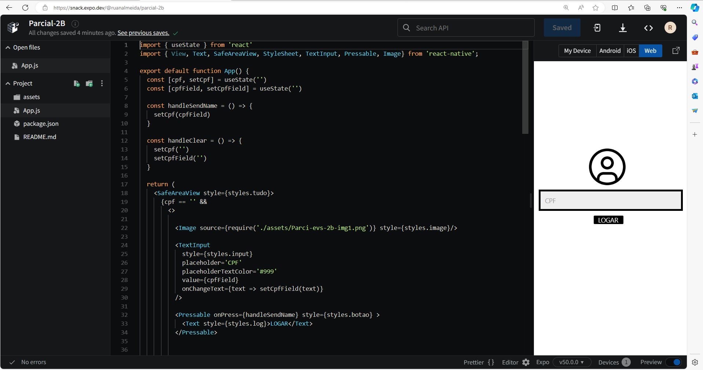

# Parcial para o 2° Bimestres de Desencolvimento Moveis

Esse projeto foi feito em JSX, pelo o facilitador 'Expo' com o intuito de destinguir as abilidades dos alunos da EEEP: Deputado Roberto Mesquita. 

#### Foto do projeto no Expo

